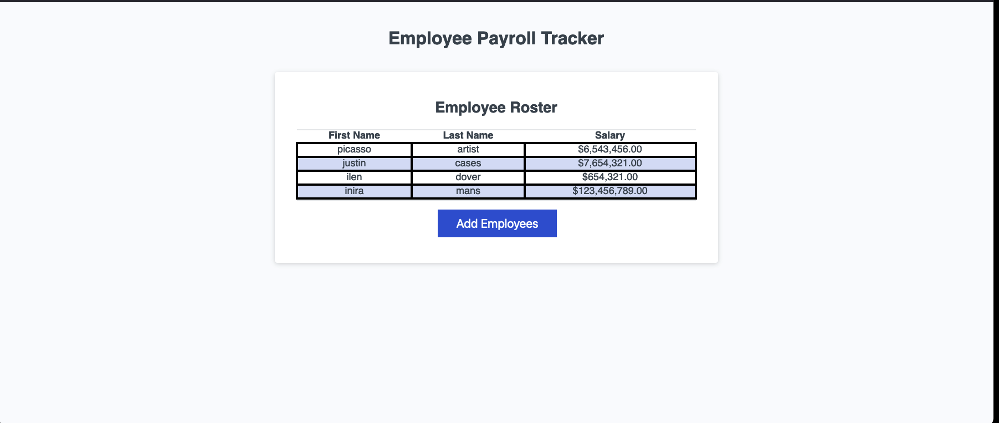

# SalarySorter
This allows the input of employs and theyre salaries, which will be sorted by the names alphabetical order.  

## Installation

To install, use git clone https://github.com/charium/SalarySorter.git to download onto local repo. 

## Usage

To use this page, simply click and read through the links and information.

To visit the page, go to web address: https://charium.github.io/SalarySorter/. 

The following page should look like: 

## Credits

This code was downloaded from the UNC-VIRT-FSF-PT-03-2024-U-LOLC source code found on the bootcamp repository. Special thanks to the course instructor, Saia Fonua for guiding me through this lesson. Help was also recieved from the course's AI XPert Learning Assistant, and the course prework module. 

## License

Please refer to the MIT Lisence found in the repo.
